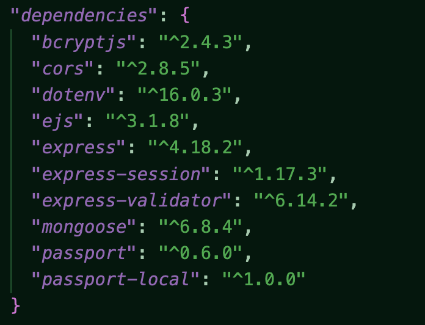

# By A Thread

## By Sharon Ogbonna
A Full Stack (MERN) Application with CRUD functionality. This project was inspired by [Notion](https://www.notion.so/), an organizational app. I named it By A Thread because sometimes you feel like that all that is holding your life together and that is okay. Hopefully this app can help with that. This repo works best with [this frontend repo](https://github.com/Sharonogbonna/project3-frontend). This app has size responsive styling - a big focus of mine - and a '90s' arcade design and color scheme.

#### Desktop Dashboard View

#### Mobile Dashboard View

## Live Links
####  Disclaimer: This application is deployed on the free tier of Render and may take a few minutes to wake up the server to load the data. When completely loaded it will look like the screenshot above.
- [By A Thread UI](https://byathread-ui.onrender.com/)
- [By A Thread Backend](https://byathread-api.onrender.com/)

## Screenshots

## Access

You can fork and or clone the repo by copy and pasting the following in your terminal. Do not forget to install the dependencies displayed below.

`https://github.com/Sharonogbonna/project3-backend`

## Technologies Used

- HTML
- JavaScript
- CSS
> MERN Stack
- MongoDb
- Mongoose
- Express
- React
- Node
- Axios
- Render Web Hosting Services

## Future Enhancements

My goal for the backend is to create a a way for there to be a log in where you can only see the information that you have added. I plan on using passport to implement this
